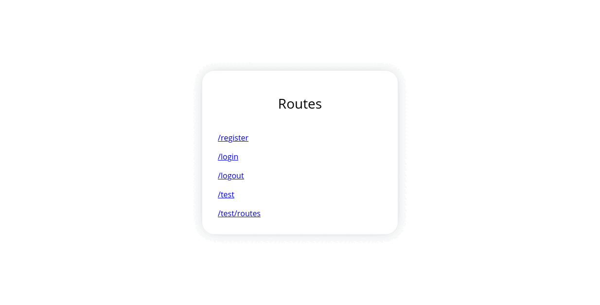

# JWT Authorization


Express jwt authorization app created in educational purposes. [Only API.](https://github.com/1mpossible-code/jwt-authorization/tree/api#jwt-authorization-api)



* [Description](#description)
* [Installation](#installation)
* [Usage](#usage)
* [Contributing](#contributing)
* [Credits](#credits)
* [License](#license)

----

## Description

App that implements authorization with [JWT](https://jwt.io/) token.

The front created on the base of [API](https://github.com/1mpossible-code/jwt-authorization/tree/api#jwt-authorization-api).

It uses [bcryptjs](https://www.npmjs.com/package/bcryptjs) to hash and verify passwords,
[eta](https://www.npmjs.com/package/eta) to render pages, [joi](https://www.npmjs.com/package/joi) to validate data,
[jwt](https://jwt.io/) as an authorization token and [mongoDB](https://www.mongodb.com/)
([mongoose](https://www.npmjs.com/package/mogoose)) as a database.

## Installation

### Dependencies:

* [docker-compose](https://docs.docker.com/compose/)
* [npm](https://www.npmjs.com/)

```shell
# Clone repo
git clone https://github.com/1mpossible-code/jwt-authorization
# Cd in it
cd jwt-authorization
# Install packages
npm install
# Copy .env.example and edit it optionally
cp .env.example .env
# Compose up
docker-compose up
```

> You will have server on http://localhost:3000/

## Usage

All routes described here:

|Method|Route|Params|Description|
|:----:|-----|:----:|-----------|
GET | /register | | Render register page
POST | /register | {name: String, email: String, password: String} | Register new user. Then show new created user's id
GET | /login | | Render login page
POST | /login | {email: String, password: String} | Login user. It will create cookie JWT token. Then redirect to test page
GET | /logout | | Logout user. Delete token from cookie
GET | /test | | Test token if token is invalid or no token at all, else you will see the information of current user
GET | /test/routes | | Render all routes page
GET | / | | Redirect to '/test/routes'

## Contributing

Feel freely to contribute this project. [Issues](https://github.com/1mpossible-code/jwt-authorization/issues)
and [PRs](https://github.com/1mpossible-code/jwt-authorization/pulls) are welcome!

## Credits

You can mail to `linme00p@gmail.com` to contact the author

# License

Copyright © 2021 [1mpossible-code](https://github.com/1mpossible-code). This project
is [GPLv3](https://www.https://www.gnu.org/licenses/gpl-3.0.htmlgnu.org/licenses/gpl-3.0) licensed.
